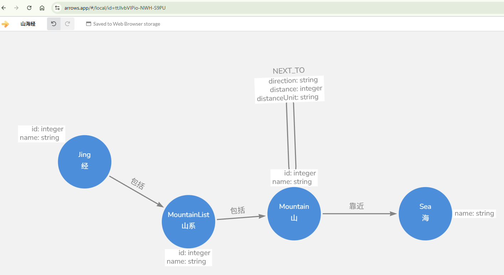

# 南山经第一

- [南山经第一](#南山经第一)
  - [南山经各次经](#南山经各次经)
  - [建模](#建模)

## 南山经各次经

- [南次一经](./nanshanjing01/README.md)
- [南次二经]()
- [南次三经]()

## 建模

根据各经中会有一个或多个山系，山系中包括多个山脉，山脉会有靠近的海，先添加对应节点，Schema如下（注意：山到山用`NEXT_TO`关系表示前后顺序）：

---

最近更新于：2025-12-20