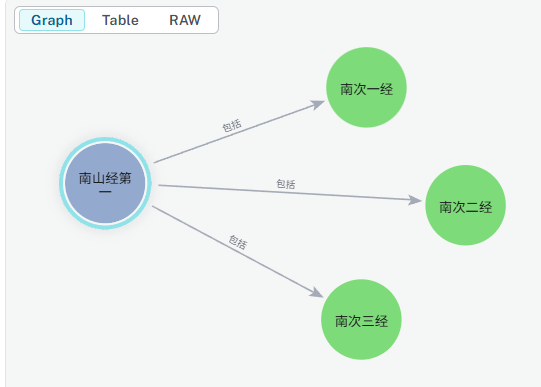

# 南山经第一

- [南山经第一](#南山经第一)
  - [南山经各次经](#南山经各次经)
  - [建模](#建模)
    - [根据更新的结构创建各个`次经`](#根据更新的结构创建各个次经)

## 南山经各次经

- [南次一经](./nanshanjing01/README.md)
- [南次二经]()
- [南次三经]()

## 建模

根据各经中会有一个或多个山系，山系中包括多个山脉，山脉会有靠近的海，先添加对应节点，Schema如下（注意：山到山用`NEXT_TO`关系表示前后顺序）：


### 根据更新的结构创建各个`次经`

```cypher
MATCH (z:主经 {name:"南山经第一"})
MERGE (c1:次经 {id:"nanshanjing01", name:"南次一经"})
MERGE (c2:次经 {id:"nanshanjing02", name:"南次二经"})
MERGE (c3:次经 {id:"nanshanjing03", name:"南次三经"})
MERGE (z)-[b1:包括]->(c1)
MERGE (z)-[b2:包括]->(c2)
MERGE (z)-[b3:包括]->(c3)
ON CREATE SET c1.createdAt = datetime(), c2.createdAt = datetime(), c3.createdAt = datetime()
ON MATCH SET c1.updatedAt = datetime(), c2.updatedAt = datetime(), c3.updatedAt = datetime()
```



---

最近更新于：2025-12-20