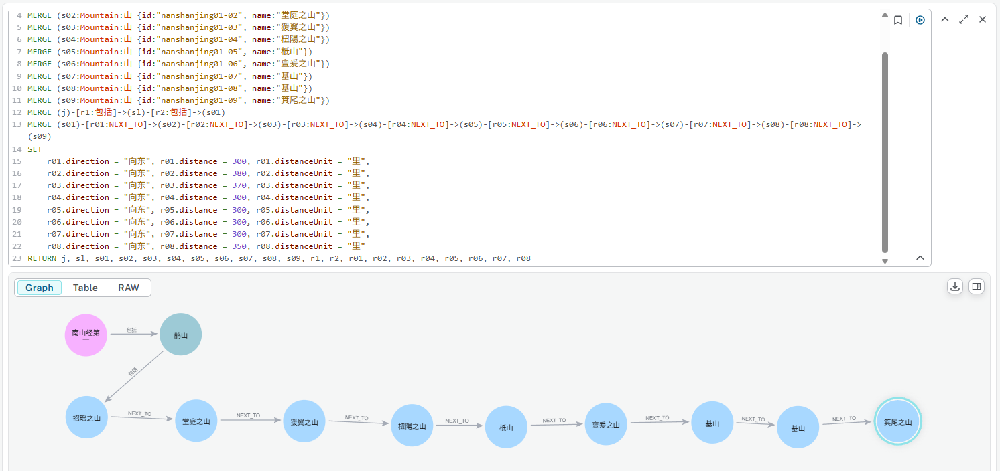
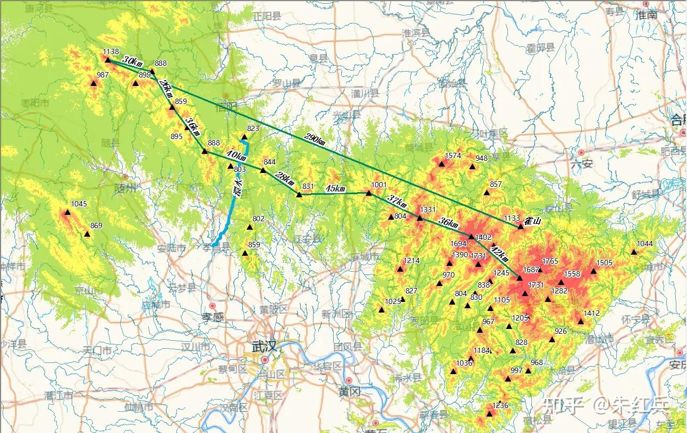
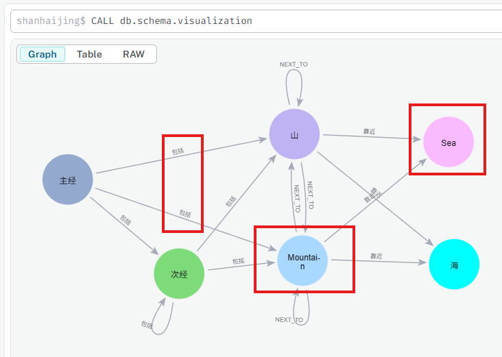
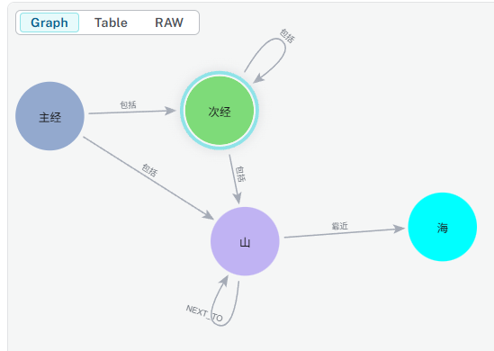
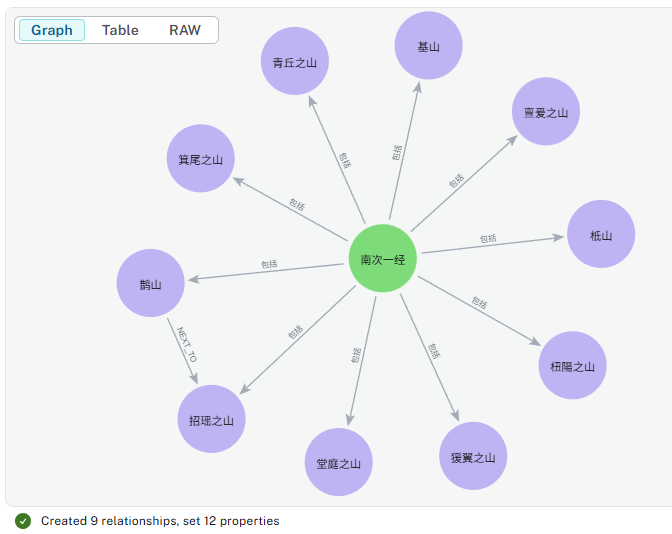
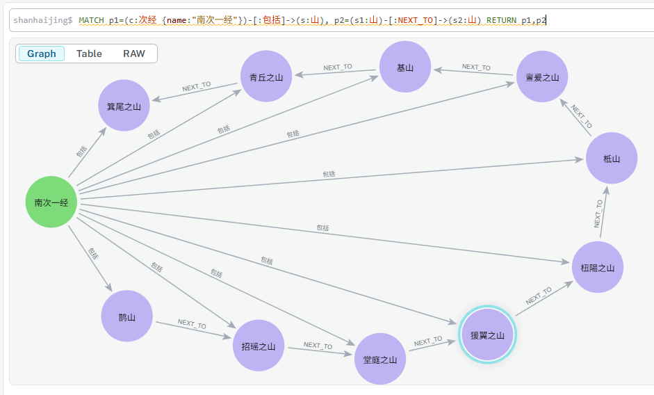

# 南山经 - 南次一经 - 鹊山山系

- [南山经 - 南次一经 - 鹊山山系](#南山经---南次一经---鹊山山系)
  - [鹊山山系的山](#鹊山山系的山)
  - [文言文](#文言文)
  - [白话文](#白话文)
  - [建模](#建模)
  - [讨论：只有九座山，为什么总结中“凡鹊山之首，自招摇之山以至箕尾之山，凡十山”？](#讨论只有九座山为什么总结中凡鹊山之首自招摇之山以至箕尾之山凡十山)
  - [模型重构 (Refactor)](#模型重构-refactor)
    - [`主经`与`次经`的调整](#主经与次经的调整)
    - [重命名`鹊山`为`南山次经`，在`山`中创建`鹊山`](#重命名鹊山为南山次经在山中创建鹊山)
    - [重构`南次一经`中的山脉关系](#重构南次一经中的山脉关系)

## 鹊山山系的山

- [南山经之首曰鹊山](./nanshanjing01/nanshanjing01-01.md)
- [其首曰招瑶之山](./nanshanjing01/nanshanjing01-02.md)
- [又东三百里曰堂庭之山]()
- [又东三百八十里曰猨翼之山]()
- [又东三百七十里曰杻陽之山]()
- [又东三百里柢山]()
- [又东三百里曰亶爰之山]()
- [又东三百曰基山]()
- [又东三百里曰青丘之山]()
- [又东三百五十里曰箕尾之山]()

## 文言文

```
凡鹊山之首，自招摇之山以至箕尾之山，凡十山，二千九百五十里，其神状皆鸟身而龙首。其祠之礼：毛，用一璋玉瘗；糈用稌米，一壁，稻米、白莹为席。
```

## 白话文

```
总计鹊山山系之首尾，从招摇山起，直到箕尾山止，一共是十座山，途经二千九百五十里。诸山山神的形状都是鸟的身子龙的头。祭祀山神的典礼；是把畜禽和璋一起埋入地下，祀神的米用稻米，用白茅草来做神的座席。
```

## 建模

```cypher
MATCH (j:Jing {name:"南山经第一"})
MERGE (sl:MountainList:山系 {id:"nanshanjing01", name:"鹊山"})
MERGE (s01:Mountain:山 {id:"nanshanjing01-01", name:"招瑶之山"})
MERGE (s02:Mountain:山 {id:"nanshanjing01-02", name:"堂庭之山"})
MERGE (s03:Mountain:山 {id:"nanshanjing01-03", name:"猨翼之山"})
MERGE (s04:Mountain:山 {id:"nanshanjing01-04", name:"杻陽之山"})
MERGE (s05:Mountain:山 {id:"nanshanjing01-05", name:"柢山"})
MERGE (s06:Mountain:山 {id:"nanshanjing01-06", name:"亶爰之山"})
MERGE (s07:Mountain:山 {id:"nanshanjing01-07", name:"基山"})
MERGE (s08:Mountain:山 {id:"nanshanjing01-08", name:"基山"}) // 此处应为青丘之山
MERGE (s09:Mountain:山 {id:"nanshanjing01-09", name:"箕尾之山"})
MERGE (j)-[r1:包括]->(sl)-[r2:包括]->(s01)
MERGE (s01)-[r01:NEXT_TO]->(s02)-[r02:NEXT_TO]->(s03)-[r03:NEXT_TO]->(s04)-[r04:NEXT_TO]->(s05)-[r05:NEXT_TO]->(s06)-[r06:NEXT_TO]->(s07)-[r07:NEXT_TO]->(s08)-[r08:NEXT_TO]->(s09)
SET
    r01.direction = "向东", r01.distance = 300, r01.distanceUnit = "里",
    r02.direction = "向东", r02.distance = 380, r02.distanceUnit = "里",
    r03.direction = "向东", r03.distance = 370, r03.distanceUnit = "里",
    r04.direction = "向东", r04.distance = 300, r04.distanceUnit = "里",
    r05.direction = "向东", r05.distance = 300, r05.distanceUnit = "里",
    r06.direction = "向东", r06.distance = 300, r06.distanceUnit = "里",
    r07.direction = "向东", r07.distance = 300, r07.distanceUnit = "里",
    r08.direction = "向东", r08.distance = 350, r08.distanceUnit = "里"
RETURN j, sl, s01, s02, s03, s04, s05, s06, s07, s08, s09, r1, r2, r01, r02, r03, r04, r05, r06, r07, r08
```

创建`鹊山山系`各个山脉与山系关系如下：



## 讨论：只有九座山，为什么总结中“凡鹊山之首，自招摇之山以至箕尾之山，凡十山”？

山海经南山经第一山系䧿山共有招摇山、堂庭山、猨翼山、杻阳山、柢山、亶爰山、基山、青丘山、箕尾山，一共九座山。为什么山中说“凡十山”？

一种说法(来源：[朱红兵](https://www.zhihu.com/question/388741686))，如下图所示，任务此`鹊山山系`就是大别山脉，对应山海经里面一里相当于现在的100米左右，图中标出了十座山。



也有说法认为是原作中遗失了一座山，因为在原文中如果将这九座山直接的距离加起来是2600里，而在总结中说是`凡十山，二千九百五十里`，中间差值为350里，倒是很像是与另一座山的距离。

在后面的大部分山经中，每一座山都有若干文字介绍，但是`鹊山`本身却是一笔带过，不太合理。

笔者这里认为比较合理的是将`鹊山`当作`南次一经`的第一座山，并补充`鹊山`到`招瑶之山`的距离为向东三百五十里，这样可以和总结中的内容契合。

基于这样的理解，要对目前的图形数据库的元模型相关设计进行下面的调整：

- 将`鹊山山系`变更为`鹊山`，类型由`山系`降为`山`，添加相应的属性
- 节点`山系`不再需要，由其变更为`次经`
- 可以将`经`的标签变更为`主经`
- 对不同的`主经`添加另外的标签`山经`、`海外经`、`海内经`和`大荒经`

## 模型重构 (Refactor)

### `主经`与`次经`的调整

```cypher
MATCH (n:`山系`), (j:Jing)
SET n:`次经`, j:`主经`
REMOVE n:`山系`, n:MountainList, j:Jing, j:`经`
RETURN j, n
```

调整后的模型schema为：



由于《山海经》是中国的文化著作，在这里可以看到，保留双语的标签名称会将模型结构变得很复杂，所以下面去掉两个英文标签，并且应该不存在`主经`到`山`这个级别的直接包含关系，继续重构：

```cypher
MATCH (m:`山`), (s:Sea)
REMOVE m:Mountain, s:Sea
RETURN m,s
```

精简后的schema如下：



### 重命名`鹊山`为`南山次经`，在`山`中创建`鹊山`

```cypher
MATCH (c:次经)
WHERE c.name = "鹊山"
SET c.name = "南次一经"
MERGE (s:山 {id:'nanshanjing01-01', name:'鹊山'})
MERGE (c)-[r:包括]->(s)
ON CREATE SET c.createdAt = datetime(), s.createdAt = datetime()
ON MATCH SET c.updatedAt = datetime(), s.updatedAt = datetime()
RETURN c,r,s
```

运行完毕后，可以从下面看到`鹊山`的类型变更成为了`山`：


因为目前`nanshanjing01-01`之前已经赋给了`招瑶之山`，所以需要将`山`的编号相应平移，同时应该建立`鹊山`到`招瑶之山`的关系，并将`南次一经`包括下面的所有10座山。

### 重构`南次一经`中的山脉关系

在上面建立山脉的命令中，`青丘之山`没有正确建立，错写成`基山`，先用下面的命令进行更正：

```cypher
MATCH (n:`山`) 
WHERE n.id = "nanshanjing01-08"
SET n.name = "青丘之山"
RETURN n LIMIT 25;
```

再进行重构：

```cypher
MATCH (s1:`山` {name:"鹊山"}), (s2:`山` {name:"招瑶之山"}), (s3:`山` {name:"堂庭之山"}), (s4:`山` {name:"猨翼之山"}), (s5:`山` {name:"杻陽之山"}), (s6:`山` {name:"柢山"}), (s7:`山` {name:"亶爰之山"}), (s8:`山` {name:"基山"}), (s9:`山` {name:"青丘之山"}), (s10:`山` {name:"箕尾之山"})
MATCH (c:次经 {name:"南次一经"})
MERGE (s1)-[r:NEXT_TO]->(s2)
SET
  s10.id = "nanshanjing01-10", s9.id = "nanshanjing01-09", s8.id = "nanshanjing01-08", s7.id = "nanshanjing01-07", s6.id = "nanshanjing01-06", s5.id = "nanshanjing01-05", s4.id = "nanshanjing01-04", s3.id = "nanshanjing01-03", s2.id = "nanshanjing01-02",
  r.direction = "向东", r.distance = 350, r.distanceUnit = "里"
MERGE (c)-[i1:包括]->(s1)
MERGE (c)-[i2:包括]->(s2)
MERGE (c)-[i3:包括]->(s3)
MERGE (c)-[i4:包括]->(s4)
MERGE (c)-[i5:包括]->(s5)
MERGE (c)-[i6:包括]->(s6)
MERGE (c)-[i7:包括]->(s7)
MERGE (c)-[i8:包括]->(s8)
MERGE (c)-[i9:包括]->(s9)
MERGE (c)-[i10:包括]->(s10)
RETURN s1,s2,s3,s4,s5,s6,s7,s8,s9,s10,r,c,i1,i2,i3,i4,i5,i6,i7,i8,i9,i10
```

结果如下：



通过下面的查询语句可以看到重构后的`南次一经`的结构：

```cypher
MATCH p1=(c:次经 {name:"南次一经"})-[:包括]->(s:山), p2=(s1:山)-[:NEXT_TO]->(s2:山)
RETURN p1,p2
```



---

最近的更新日期：2025-12-20