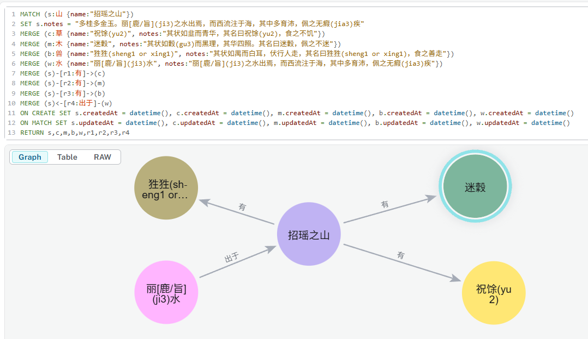
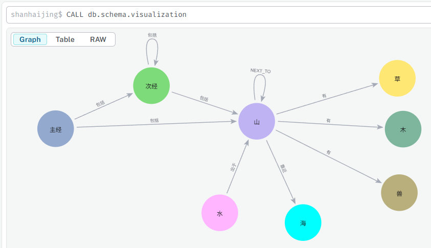

# 南山经 - 鹊山山系 - 招瑶之山

- [南山经 - 鹊山山系 - 招瑶之山](#南山经---鹊山山系---招瑶之山)
  - [原文](#原文)
  - [生僻字](#生僻字)
  - [白话文](#白话文)
  - [图形数据库建模](#图形数据库建模)
    - [(2025-12-20) 山系和山](#2025-12-20-山系和山)
    - [创建`招瑶之山`的各个内容关系](#创建招瑶之山的各个内容关系)
    - [截止目前的Schema (2025-12-20, Schema-0005)](#截止目前的schema-2025-12-20-schema-0005)

## 原文

```
南山经之首曰鹊山。
其首曰招瑶之山，临于西海之上。
多桂多金玉。
有草焉，其状如韭而青华，其名曰祝馀(yu2)，食之不饥。
有木焉，其状如穀(gu3)而黑理，其华四照。其名曰迷穀，佩之不迷。
有兽焉，其状如禺而白耳，伏行人走，其名曰狌狌(sheng1 or xing1)，食之善走。
丽[鹿/旨](ji3)之水出焉，而西流注于海，其中多育沛，佩之无瘕(jia3)疾。
```

## 生僻字


## 白话文

```
南方首列山系叫做鹊山山系。
鹊山山系的头一座山是招摇山，屹立在西海岸边。
生长着许多桂树，又蕴藏着丰富的金属矿物和玉石。
山中有一种草，形状像韭菜却开着青色的花朵，名称是祝余，人吃了它就不感到饥饿。
山中又有一种树木，形状像构树却呈现黑色的纹理，并且光华照耀四方，名称是迷穀，人佩带它在身上就不会迷失方向。
山中还有一种野兽，形状像猿猴但长着一双白色的耳朵，既能匍伏爬行，又能像人一样直立行走，名称是狌狌，吃了它的肉可以使人走得飞快。
丽水从这座山发源，然后往西流入大海，水中有许多叫做育沛的东西，人佩带它在身上就不会生蛊胀玻
```

## 图形数据库建模 

### (2025-12-20) 山系和山

建立`山系`和`山`的节点(node)，根据文言文与白话文，在建立相关对应节点的同时，创建连接的关系：

```cypher
MATCH (j:Jing {name:"南山经第一"})
MERGE (sl:MountainList:山系 {id:"nanshanjing01", name:"鹊山"})
MERGE (s:Mountain:山 {id:"nanshanjing01-01", name:"招瑶之山"})
MERGE (o:Sea:海 {name:"西海"})
MERGE (j)-[r1:包括]->(sl)-[r2:包括]->(s)-[r3:靠近]->(o)
ON CREATE SET j.createdAt = datetime(), sl.createdAt = datetime(), s.createdAt = datetime(), o.createdAt = datetime()
ON MATCH SET j.updatedAt = datetime()， sl.updatedAt = datetime(), s.updatedAt = datetime(), o..updatedAt = datetime()
RETURN j, sl, s, o, r1, r2, r3
```

注意：这里我们同时创建了节点上面的中英文两个标签，这样是为了方便为了的查询，而关系直接使用中文，就是要仔细选择确保关系的名称是足够清晰的动词。

运行之后的结果如下：


### 创建`招瑶之山`的各个内容关系

```cypher
MATCH (s:山 {name:"招瑶之山"})
SET s.notes = "多桂多金玉。丽[鹿/旨](ji3)之水出焉，而西流注于海，其中多育沛，佩之无瘕(jia3)疾"
MERGE (c:草 {name:"祝馀(yu2)", notes:"其状如韭而青华，其名曰祝馀(yu2)，食之不饥"})
MERGE (m:木 {name:"迷穀", notes:"其状如穀(gu3)而黑理，其华四照。其名曰迷穀，佩之不迷"})
MERGE (b:兽 {name:"狌狌(sheng1 or xing1)", notes:"其状如禺而白耳，伏行人走，其名曰狌狌(sheng1 or xing1)，食之善走"})
MERGE (w:水 {name:"丽[鹿/旨](ji3)水", notes:"丽[鹿/旨](ji3)之水出焉，而西流注于海，其中多育沛，佩之无瘕(jia3)疾"})
MERGE (s)-[r1:有]->(c)
MERGE (s)-[r2:有]->(m)
MERGE (s)-[r3:有]->(b)
MERGE (s)<-[r4:出于]-(w)
ON CREATE SET s.createdAt = datetime(), c.createdAt = datetime(), m.createdAt = datetime(), b.createdAt = datetime(), w.createdAt = datetime()
ON MATCH SET s.updatedAt = datetime(), c.updatedAt = datetime(), m.updatedAt = datetime(), b.updatedAt = datetime(), w.updatedAt = datetime()
RETURN s,c,m,b,w,r1,r2,r3,r4
```

创建了新的节点：草，木，兽，水



### 截止目前的Schema (2025-12-20, Schema-0005)



---

最近更新于：2025-12-21