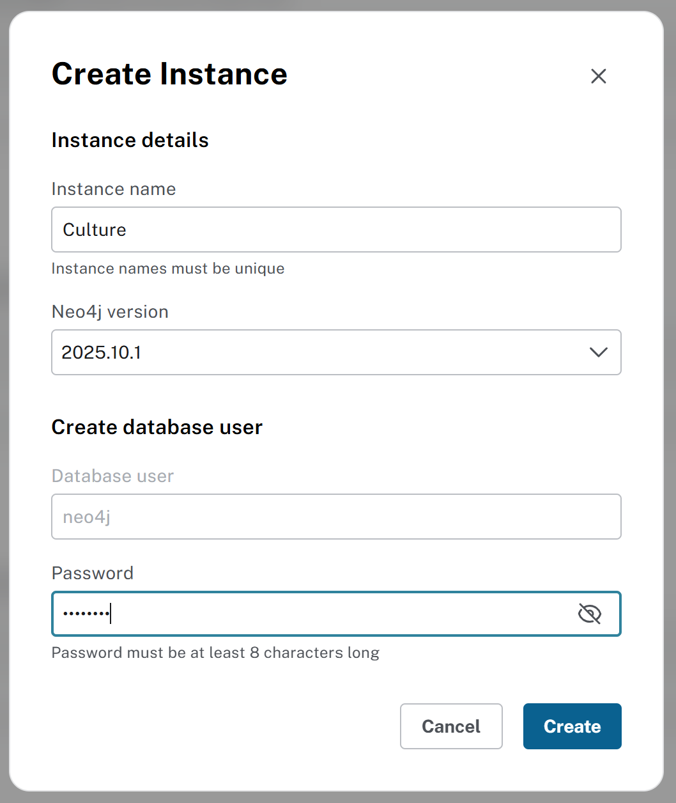
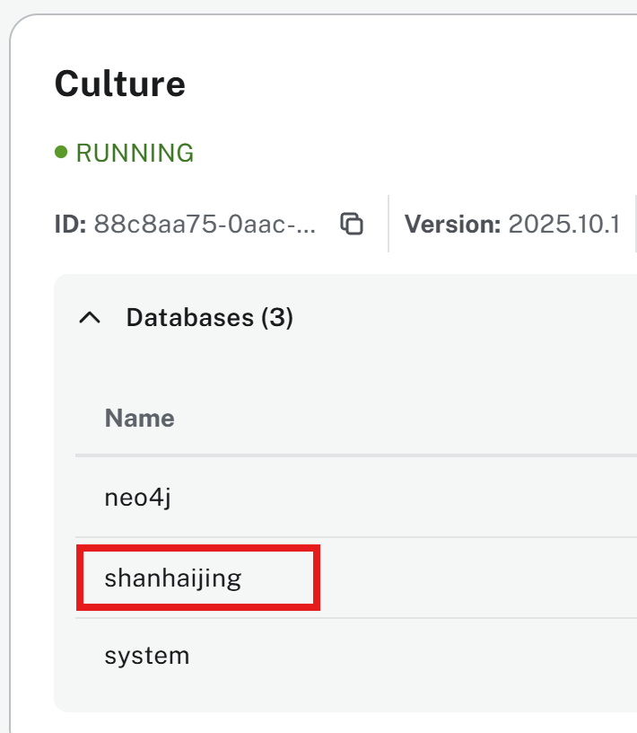
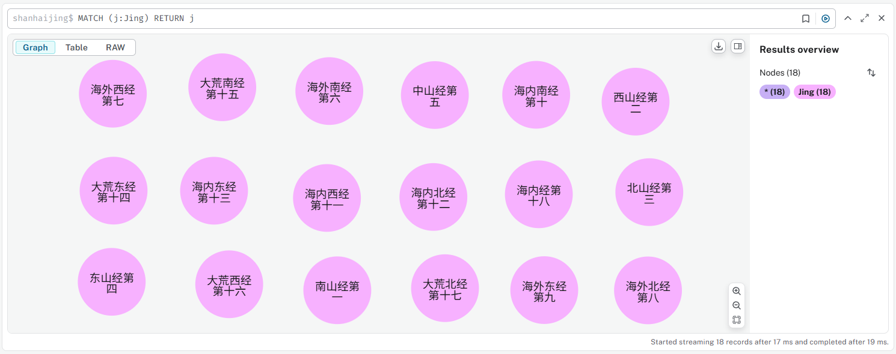

# 山海经 (Shan Hai Jing)

学习《山海经》并练习使用图形数据库(Neo4j)进行建模

- [山海经 (Shan Hai Jing)](#山海经-shan-hai-jing)
  - [概览 (Overview)](#概览-overview)
  - [关于生僻字的说明 (About Some Uncommon Characters)](#关于生僻字的说明-about-some-uncommon-characters)
  - [内容](#内容)
  - [创建图形数据库](#创建图形数据库)

## 概览 (Overview)

|||
|--- | --- |
| 《山海经》乃中国古代流传下来的一部奇书，除了阅读其中包含的午睡奇山异川、鸟兽花木、各种金石等等，整个著作展开的更是一部中国-乃至海内海外-的宏大地理画卷。|  |

笔者深知此书的博大精深，一直希望能够对其仔细研读，并吸收其中的中国的灿烂文化，更因为在信息技术领域的长期学习与实践，尤其是近年来基础到本体(Ontology)、语义网(Semantic Web)与图形数据库(Graph Database)等，感觉如果能够从图的角度对《山海经》进行分析与建模，那应该更能够让这个文化的瑰宝方便为大众来了解。

有鉴于此，这里我将试着将《山海经》建立到图形数据库中，并记录下建模的全部历程，包括但不限于：

- 图形数据库选择Neo4j的桌面版本，版本号为v2.x
- 逐步建立能够覆盖全部《山海经》内各个概念(concept)的元模型(meta model)，也即schema
- 每个部分的建立都记录下详细的查询语句，在Neo4j中查询语言为Cypher
- 随数据库的建立，探讨并提供参考的查询用例

希望这个图形数据库能够让大家用来作为访问和学习《山海经》的案头工具，并激发大家创建出更丰富的查询用例来增加使用的场景。

这里，用下面的“千里江山图”来代表中国的壮丽河山：


## 关于生僻字的说明 (About Some Uncommon Characters)

书中很多字不仅目前极少使用，更是由于字库未收录导致无法通过输入法直接键入，对于这些生僻的文字，（参考《白话山海经》一书之方法），约定采用`符号加汉字描述法`如下范例：

- [囱比]：左`囱`(cong)右`比`，`[]`表示两字合一字
- [门©豕]：外`门`内`豕`(shi)，`©`(Alt+0169)表示内外结构的字
- [此/鱼]：上`此`下`鱼`， `/`表示上下结构的字
- [足鵕-鸟]：由`足`和`鵕`(jun)的左边拼为一字，`-`表示去掉
- 白话文部分若看到黑色小方块 - `■`(Alt+254)表示缺失字，参考原文言文阅读

## 内容

- [南山经第一](./01_NanShanJing/README.md), [西山经第二](./02_XiShanJing/README.md), [北山经第三](./03_BeiShanJing/README.md), [东山经第四](./04_DongShanJing/README.md), [中山经第五](./05_ZhongShanJing/README.md)
- [海外南经第六](./06_HaiWaiNanJing/README.md), [海外西经第七](./07_HaiWaiXiJing/README.md), [海外北经第八](./08_HaiWaiBeiJing/README.md), [海外东经第九](./09_HaiWaiDongJing/README.md)
- [海内南经第十](./10_HaiNeiNanJing/README.md), [海内西经第十一](./11_HaiNeiXiJing/README.md), [海内北经第十二](./12_HaiNeiBeiJing/README.md), [海内东经第十三](./13_HaiNeiDongJing/README.md)
- [大荒东经第十四](./14_DaHuangDongJing/README.md), [大荒南经第十五](./15_DaHuangNanJing/README.md), [大荒西经第十六](./16_DaHuangXiJing/README.md), [大荒北经第十七](./17_DaHuangBeiJing/README.md)
- [海内经第十八](./18_HaiNeiJing/README.md)

## 创建图形数据库

Neo4j Desktop 2.0.5

| Instance: Culture | Database: ShanHaiJing |
| --- | --- |
|  |  |

```SQL
MERGE (:Jing {id:1, name:"南山经第一"})
MERGE (:Jing {id:2, name:"西山经第二"})
MERGE (:Jing {id:3, name:"北山经第三"})
MERGE (:Jing {id:4, name:"东山经第四"})
MERGE (:Jing {id:5, name:"中山经第五"})
MERGE (:Jing {id:6, name:"海外南经第六"})
MERGE (:Jing {id:7, name:"海外西经第七"})
MERGE (:Jing {id:8, name:"海外北经第八"})
MERGE (:Jing {id:9, name:"海外东经第九"})
MERGE (:Jing {id:10, name:"海内南经第十"})
MERGE (:Jing {id:11, name:"海内西经第十一"})
MERGE (:Jing {id:12, name:"海内北经第十二"})
MERGE (:Jing {id:13, name:"海内东经第十三"})
MERGE (:Jing {id:14, name:"大荒东经第十四"})
MERGE (:Jing {id:15, name:"大荒南经第十五"})
MERGE (:Jing {id:16, name:"大荒西经第十六"})
MERGE (:Jing {id:17, name:"大荒北经第十七"})
MERGE (:Jing {id:18, name:"海内经第十八"})
```

```
Created 18 nodes, set 36 properties, added 18 labels
```



增加`经`作为另外一个的中文的标签：

```SQL
MATCH (j:Jing)
SET j:经
RETURN j
```

在 https://arrows.app/ 同步建立图形数据库的schema如下：


---

Last Updated at 2025-12-20